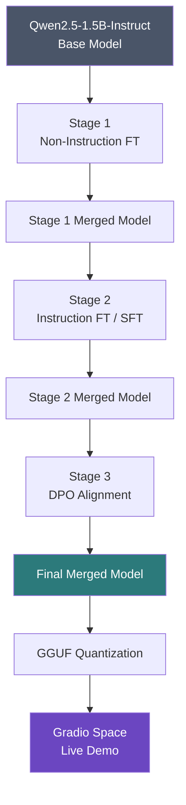
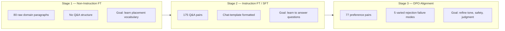
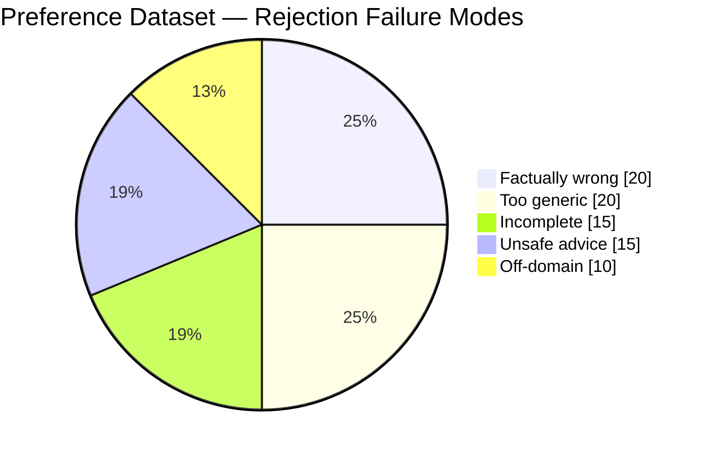
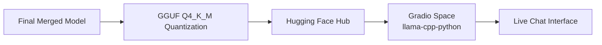

# 🎓 Placement & Interview Prep Assistant

**A domain-specific LLM fine-tuned end-to-end to give College Placement & Interview Prep guidance — built with Qwen2.5-1.5B, Unsloth, QLoRA, and a 3-stage fine-tuning pipeline (Non-Instruction FT → SFT → DPO Alignment).**

[]()
[]()
[]()
[]()

---

## Table of Contents

1. [Problem Statement](#1-problem-statement)
2. [Why This Domain](#2-why-this-domain)
3. [Architecture Overview](#3-architecture-overview)
4. [The 3-Stage Pipeline](#4-the-3-stage-pipeline)
5. [Dataset Details](#5-dataset-details)
6. [Model & LoRA Configuration](#6-model--lora-configuration)
7. [Training Results](#7-training-results)
8. [Before vs After — Base Model vs Final Model](#8-before-vs-after--base-model-vs-final-model)
9. [Repository Structure](#9-repository-structure)
10. [How to Run This Project](#10-how-to-run-this-project)
11. [Live Demo](#11-live-demo)
12. [Evaluation Methodology](#12-evaluation-methodology)
13. [Challenges Faced](#13-challenges-faced)
14. [Future Improvements](#14-future-improvements)

---

## 1. Problem Statement

As a GenAI Engineer building an assistant for a campus placement consultancy,
the goal was to create an AI system that gives **specific, actionable, company-aware
placement preparation guidance** — not the generic advice a base LLM already gives.

A base model, when asked "How should I prepare for Amazon SDE-1?", responds with
advice generic enough to apply to any tech job anywhere in the world. This project
fine-tunes a small, efficient model to instead give answers that reference real
company round structures, DSA topic priorities, behavioral frameworks, and
placement-specific edge cases (CGPA cutoffs, backlogs, offer negotiation).

## 2. Why This Domain

| Factor | Reasoning |
|---|---|
| **Relatability** | Every CSE student has a personal stake in placement outcomes |
| **Visible improvement** | Base model gives generic advice; fine-tuned model names specific rounds, companies, frameworks — an easily observable gap |
| **Uniqueness** | Most fine-tuning submissions default to generic HR/customer-support bots — this domain stands apart |
| **Data availability** | Company round structures, DSA priorities, and interview frameworks are well-documented and structurable into clean Q&A pairs |

## 3. Architecture Overview



Each stage **merges its LoRA adapter into the base weights before the next stage
begins** — Stage 2 doesn't start from the raw base model, it starts from a model
that already has Stage 1's domain knowledge baked in. This "merge-then-reload"
approach means every stage builds cleanly on top of a fully-formed checkpoint,
rather than stacking adapters on adapters.

## 4. The 3-Stage Pipeline



| Stage | What It Teaches | Data Used | Why It's Needed |
|---|---|---|---|
| **Stage 1** — Non-Instruction FT | Domain vocabulary & writing style (bar-raiser, NQT, PPO, CGPA cutoff) | 80 raw text paragraphs | Shifts the model's internal representation toward placement-specific language *before* it learns to answer questions |
| **Stage 2** — Instruction FT (SFT) | How to answer a question directly and specifically | 175 instruction-response pairs | The single biggest quality jump — model goes from "completing text" to "answering questions" |
| **Stage 3** — DPO Alignment | What *not* to say — safety, specificity, professionalism | 77 chosen/rejected preference pairs | Refines judgment: avoids unsafe advice, off-domain answers, and generic/incomplete responses |

## 5. Dataset Details

| Dataset | Size | Format | Generation Method |
|---|---|---|---|
| Non-instruction corpus | 80 paragraphs | Plain text, `\n\n`-separated | GPT-4o generated, seeded with 20 hand-written domain facts |
| Instruction (SFT) dataset | 175 pairs | JSONL — `{instruction, response}` | GPT-4o generated, manually cleaned (deduplicated, verified) |
| Preference (DPO) dataset | 77 pairs | JSONL — `{prompt, chosen, rejected}` | GPT-4o generated, 5 varied rejection failure modes |

**Rejection failure mode distribution (DPO dataset):**



## 6. Model & LoRA Configuration

| Parameter | Value | Reason |
|---|---|---|
| Base model | `Qwen2.5-1.5B-Instruct` | Best small instruction-following model on Unsloth; fast inference on free T4 |
| LoRA rank (r) | 32 | Above assignment minimum — sufficient capacity for 175 SFT examples without overfitting |
| LoRA alpha | 64 | Standard 2×r ratio |
| LoRA dropout | 0.05 | Light regularization for small dataset |
| Quantization | 4-bit (QLoRA) | Fits entire 3-stage pipeline on free Colab T4 (16GB VRAM) |
| Stage 1/2 learning rate | 2e-4 | Unsloth's tested default for LoRA fine-tuning |
| Stage 3 (DPO) learning rate | 5e-5 | Much lower — prevents reward collapse during preference alignment |
| DPO beta | 0.1 | Standard value from the original DPO paper |
| Effective batch size | 8 (2 × 4 grad accumulation) | Balances stability and free-tier VRAM limits |

## 7. Training Results

| Stage | Final Loss | Training Time | Peak VRAM |
|---|---|---|---|
| Stage 1 (Non-Instruction FT) | 2.44 | ~0.6 min | 2.67 GB |
| Stage 2 (SFT) | 1.10 | ~2.9 min | 2.07 GB |
| Stage 3 (DPO) | *(see training logs)* | *(see training logs)* | *(see training logs)* |

*Screenshot your actual Stage 3 output here before submission.*

## 8. Before vs After — Base Model vs Final Model

| Question | Base Model | Final (DPO) Model |
|---|---|---|
| How should I prepare for Amazon SDE-1? | Generic DSA advice, no round structure | Names bar-raiser round, 16 Leadership Principles, priority DSA topics |
| I have a 6.5 CGPA. Can I still get good companies? | Vague encouragement | Company-specific thresholds + honest, actionable path forward |
| What is the TCS NQT exam pattern? | Generic "online test + interview" | Names all sections (Verbal, Reasoning, Quantitative, Coding) with strategy |

*Full 10-question comparison tables live in [`reports/final_evaluation.md`](reports/final_evaluation.md).*

## 9. Repository Structure

```
placement-interview-assistant/
├── data/
│   ├── non_instruction_corpus.txt
│   ├── instruction_dataset.jsonl
│   ├── preference_dataset.jsonl
│   └── seed_facts.txt
│
├── notebooks/
│   ├── 00_dataset_generation.ipynb
│   ├── 01_non_instruction_ft.ipynb
│   ├── 02_sft_training.ipynb
│   └── 03_orpo_training.ipynb
│
├── eval/
│   ├── showcase_questions.txt
│   ├── eval_results.json
│   └── llm_judge_eval.py
│
├── reports/
│   ├── base_model_evaluation.md        # Step 5
│   ├── sft_model_comparison.md         # Step 7
│   ├── final_evaluation.md             # Step 10
│   ├── fine_tuning_explanation.md      # Step 11
│   ├── full_progression_comparison.md  # Bonus
│   └── ablation_study.md               # Bonus
│
├── src/
│   └── inference.py                    # Step 12
│
├── demo/
│   └── gradio_app.py
│
├── README.md
└── requirements.txt
```

## 10. How to Run This Project

```bash
# 1. Clone the repo
git clone <your-repo-url>
cd placement-interview-assistant

# 2. Install dependencies
pip install -r requirements.txt

# 3. Run the 3-stage training pipeline (in order)
# Open in Google Colab with a T4 GPU runtime:
notebooks/01_non_instruction_ft.ipynb   # Stage 1
notebooks/02_sft_training.ipynb          # Stage 2
notebooks/03_orpo_training.ipynb         # Stage 3

# 4. Run inference locally
python src/inference.py "How should I prepare for Amazon SDE-1 placement?"

# 5. Run the LLM-as-a-judge evaluation
cd eval && python llm_judge_eval.py
```

## 11. Live Demo

The final model is served via a Gradio Space, running a Q4_K_M GGUF-quantized
version through `llama-cpp-python` on free CPU hardware.

**Try it here:** *[Your Hugging Face Space link]*



## 12. Evaluation Methodology

Three layers of evaluation were used, going beyond the assignment minimum:

1. **Manual comparison tables** (Steps 5, 7, 10) — question-by-question,
   base vs SFT vs DPO, with human-written reasoning.
2. **Stage-by-stage progression reports** (bonus) — isolates exactly what
   each individual stage contributed, not just the final before/after.
3. **LLM-as-a-Judge automated scoring** (bonus) — GPT-4o-mini scores all
   three models on 5 criteria (correctness, domain accuracy, clarity,
   safety, helpfulness) across all showcase questions, producing a
   numerical evaluation table instead of relying purely on manual judgment.

## 13. Challenges Faced

- **EOS token omission in early SFT formatting** caused the model to never
  learn where a response should end, leading to hallucinated follow-up
  questions during inference — fixed by appending `tokenizer.eos_token`
  to every training example.
- **Gradio history format mismatch** between older tuple-based and newer
  dict-based chat history broke the live demo — fixed by handling both
  formats defensively in the `respond()` function.
- **llama.cpp segfault during Gradio's example pre-caching** — fixed by
  setting `cache_examples=False`.
- **Free-tier GPU memory management** across 3 sequential fine-tuning
  stages required explicit `clear_gpu_memory()` calls between stages to
  avoid OOM errors when loading each subsequent merged model.

## 14. Future Improvements

- Scale to a 7B parameter model for reduced hallucination on precise
  numerical facts (CGPA cutoffs, round counts).
- Expand the SFT dataset to 500+ examples, specifically targeting
  unscripted, casual, and compound-topic phrasing.
- Layer RAG (Retrieval-Augmented Generation) on top of the fine-tuned
  model to ground company-specific facts in a retrievable document store
  rather than relying purely on parametric memory.

---

**Built for:** LLM Fine-Tuning Hackathon 2026
**Pipeline:** Unsloth + QLoRA + TRL (SFTTrainer, DPOTrainer)
**Author:** Gourab Swain